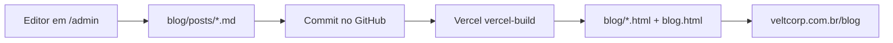

# 📚 Velt Website — Project Handover Documentation

> Last updated: March 2026  
> Maintainer contact: Bruno Brant (CEO) · Wellerson Junior (CTO)

---

## 1. Overview

The **Velt corporate website** (`veltcorp-website`) is a server-rendered Node.js site for **Velt Corp** — a Brazilian B2B SaaS platform for corporate travel management. The site is deployed on **Vercel** and the source is hosted at [github.com/veltcorp/velt-site-new](https://github.com/veltcorp/velt-site-new).

**Company facts embedded in site copy:**
- CNPJ: 61.127.816/0001-75
- Brand color (primary / CTA): `#FF6B00` (orange)
- Body color (secondary): `#1E293B` (slate-800)
- Font: Inter (Google Fonts)
- Styling framework: Tailwind CSS v3 (via CDN — no build step needed)
- Language: Brazilian Portuguese

---

## 2. Repository & Deployment

| Item | Value |
|---|---|
| GitHub (org) | `https://github.com/veltcorp/velt-site-new` |
| GitHub (personal mirror) | `https://github.com/eduardovaladares/velt-site-new` |
| Deployment | Vercel (connected to `veltcorp` GitHub org) |
| Runtime | Node.js (`server.js` with Express) |
| Branch to deploy | `main` |

### Git Remotes (local)
```
origin          → github.com/eduardovaladares/velt-site-new.git  (personal)
publish-remote  → github.com/veltcorp/velt-site-new.git          (org — Vercel watches this)
```

### Deploying Updates
```bash
# 1. Stage all changes
git add -A

# 2. Commit
git commit -m "feat: describe what changed"

# 3. Push to the org remote (triggers Vercel auto-deploy)
git push publish-remote main
```

> Vercel auto-deploys on every push to `main` on the `veltcorp` org repo.  
> No manual Vercel action needed.

---

## 3. Local Development

### Prerequisites
- Node.js ≥ 18
- npm

### Setup
```bash
cd "Velt Stuff/veltcorp-website"
npm install
npm start          # starts Express server at http://localhost:3000
```

### Blog watch mode (auto-rebuild on Markdown changes)
```bash
npm run watch      # watches blog/posts/*.md and rebuilds
```

---

## 4. Project Structure

```
veltcorp-website/
├── index.html                    # Home / Landing page
├── solucoes.html                 # Solutions page
├── funcionalidades.html          # Features / Product page
├── sobre.html                    # About Us page
├── parceiros.html                # Partners page
├── blog.html                     # Blog index (auto-regenerated)
├── contato.html                  # Contact / Demo booking page
├── politicas-de-privacidade.html # Privacy Policy
├── termos-de-uso.html            # Terms of Use
│
├── blog/                         # Blog content
│   ├── posts/                    # ✏️  Markdown source files (40+ articles)
│   ├── pillar-*.html             # Auto-generated pillar category pages (7 pillars)
│   ├── *.html                    # Auto-generated individual article pages
│   └── template.html             # HTML template used for all blog posts
│
├── assets/
│   ├── logoVelt.png              # Brand logo
│   ├── Clients-Logo/             # Client logos (1.png – 15.png)
│   ├── users-testimonial-photo/  # Testimonial headshots
│   ├── bruno brant.JPG           # CEO photo (used on sobre.html)
│   ├── wellerson assumpcao.JPG   # CTO photo (used on sobre.html)
│   ├── buscador.png              # Product screenshot (funcionalidades.html)
│   ├── gif tour completo.gif     # Product demo GIF
│   └── hero-gif.mp4              # Hero video
│
├── js/
│   └── layout.js                 # 🔑 Shared header + footer (injected into every page)
│
├── public/
│   └── admin/                    # Decap CMS (editor web do blog)
│       ├── index.html
│       └── config.yml
│
├── scripts/
│   ├── build-blog.js             # Blog build pipeline (MD → HTML)
│   ├── new-post.js               # CLI to scaffold a new blog post
│   ├── generate-from-keywordmap.js # AI-assisted bulk blog generation
│   └── generate-og-images.js     # OG image generator
│
├── server.js                     # Express server (serves all routes)
├── vercel.json                   # Vercel deployment config
├── package.json                  # npm scripts & dependencies
└── process_blog.py               # Python utility for blog processing
```

---

## 5. Navigation & Layout System

**All pages share one header and one footer**, dynamically injected by `js/layout.js`.

Every HTML page must include these two `<div>` placeholders and the script tag:

```html
<body>
  <div id="main-header"></div>   <!-- Header injected here -->

  <!-- ... page content ... -->

  <div id="main-footer"></div>   <!-- Footer injected here -->
  <script src="js/layout.js"></script>  <!-- or ../js/layout.js if inside /blog/ -->
</body>
```

`layout.js` automatically detects whether it is running from the root or from `/blog/` and adjusts all relative paths accordingly (via `getBasePath()`).

### To update the navigation links
Edit `js/layout.js` → the `loadHeader()` and `loadFooter()` functions. Changes apply to **all pages at once**.

---

## 6. Blog System

The blog uses a **Markdown → HTML pipeline** managed by `scripts/build-blog.js`.

### Publishing flow (production)



1. Editor writes in **Decap CMS** at `https://veltcorp.com.br/admin`
2. On Publish, Decap commits a `.md` file to `blog/posts/` via GitHub API
3. Vercel detects the push and runs `vercel-build` (`scripts/build-blog.js`)
4. Generated HTML pages are deployed; post appears on the site in ~1–3 minutes

> Full one-time setup (GitHub OAuth, Vercel env vars, collaborator access): see [`BLOG_CMS_SETUP.md`](BLOG_CMS_SETUP.md).

### How the build works
1. Each `.md` file in `blog/posts/` has YAML front matter
2. `npm run build` (or `vercel-build` on deploy) converts MD → HTML
3. The script:
   - Converts each `.md` to a full HTML page using `blog/template.html`
   - Updates the article grid in `blog.html`
   - Regenerates the 7 pillar category pages

### Creating a new blog post

**Option A — Decap CMS (recommended for editors)**
1. Go to `https://veltcorp.com.br/admin`
2. Log in with GitHub (account must have Write access to the repo)
3. Click **New Blog**, fill in fields, write content, click **Publish**
4. Wait 1–3 minutes for Vercel to deploy

**Option B — Interactive CLI (for developers)**
```bash
npm run new-post
```
You will be prompted for: title, pillar, author, description.

**Option C — CLI flags (non-interactive)**
```bash
node scripts/new-post.js \
  --title "Meu Artigo" \
  --pillar "Tecnologia" \
  --author "Velt Corp" \
  --description "Breve resumo para SEO"
```

Then open the generated `.md` file in `blog/posts/`, write the content, and run:
```bash
npm run build
git add -A && git commit -m "blog: novo post" && git push publish-remote main
```

### Front matter reference

```yaml
---
title: "Título do Artigo"
date: "2026-03-09"           # YYYY-MM-DD
author: "Nome do Autor"
description: "Resumo curto (usado no card e no meta SEO)"
pillar: "Tecnologia"         # see valid pillars below
image: ""                    # optional: override default pillar image
tags: ["Tecnologia"]
---
```

### Valid content pillars

| Pillar | Slug | Color |
|---|---|---|
| Viagens Corporativas | `viagens-corporativas` | Blue |
| Redução de Custos | `reducao-de-custos` | Green |
| Financeiro | `financeiro` | Amber |
| Operação | `operacao` | Purple |
| Tecnologia | `tecnologia` | Pink |
| Gestão de Milhas | `gestao-de-milhas` | Red |
| Experiência do Viajante | `experiencia-do-viajante` | Cyan |

---

## 7. Page-by-Page Reference

| Page | File | Purpose | Key Notes |
|---|---|---|---|
| Home | `index.html` | Main landing / conversion page | Hero video (`hero-gif.mp4`), social proof logos, testimonials, CEO section |
| Soluções | `solucoes.html` | Solution overview with interactive use-case tabs | 3 buyer personas with "old way vs Velt way" comparison |
| Funcionalidades | `funcionalidades.html` | Feature deep-dive (Dashboard, Trips, Approvals, Expenses) | Includes `buscador.png` screenshot + product GIF |
| Sobre Nós | `sobre.html` | Founder story / About page | Photos: `bruno brant.JPG`, `wellerson assumpcao.JPG` |
| Indique e ganhe (`/parceiros`) | `parceiros.html` | Referral / partner program | Nav label “Indique e ganhe”; URL slug stays `parceiros` |
| Blog | `blog.html` | Blog index | ⚠️ Do NOT manually edit the article grid — it is overwritten by `npm run build` |
| Contato | `contato.html` | Demo scheduling / contact form | CTA → book a call with Bruno |
| Privacidade | `politicas-de-privacidade.html` | Privacy policy | Legal |
| Termos | `termos-de-uso.html` | Terms of use | Legal |

---

## 8. Design System

All styles are applied via **Tailwind CSS v3** loaded from CDN. Custom tokens are declared inline on each page via `tailwind.config`:

```js
tailwind.config = {
  theme: {
    extend: {
      colors: {
        primary: '#FF6B00',     // Orange — CTAs, highlights, active states
        secondary: '#1E293B',   // Dark slate — headings, footer bg
        surface: '#F8FAFC',     // Light grey — page background
      },
      fontFamily: { sans: ['Inter', 'sans-serif'] },
    }
  }
}
```

**Icons:** Google Material Icons (loaded from CDN).  
**Animations:** Tailwind transitions + `translate`, `scale`, and `shadow` utilities.

---

## 9. Social Links & Brand Accounts

| Platform | URL |
|---|---|
| LinkedIn (Velt) | https://www.linkedin.com/company/velt-corp/ |
| Instagram | https://www.instagram.com/velt.corp |
| Facebook | https://www.facebook.com/veltcorporativo |
| LinkedIn (Bruno Brant – CEO) | https://www.linkedin.com/in/bruno-brant-gotschalg/ |
| LinkedIn (Wellerson Junior – CTO) | https://www.linkedin.com/in/waajunior/ |

---

## 10. Dependencies

| Package | Purpose |
|---|---|
| `express` | HTTP server / routing |
| `marked` | Converts Markdown blog posts to HTML |
| `front-matter` | Parses YAML front matter from `.md` files |
| `dotenv` | Loads environment variables from `.env` |

---

## 11. Environment Variables

The project uses a `.env` file locally (not committed to Git). Production values are set in **Vercel → Project Settings → Environment Variables**.

| Variable | Required | Purpose |
|---|---|---|
| `GITHUB_CLIENT_ID` | Yes (prod CMS) | GitHub OAuth App client ID |
| `GITHUB_CLIENT_SECRET` | Yes (prod CMS) | GitHub OAuth App client secret |
| `OAUTH_STATE_SECRET` | Yes (prod CMS) | Random string for OAuth CSRF protection |
| `SITE_URL` | Optional | Override base URL (default: inferred from request) |

See [`.env.example`](.env.example) and [`BLOG_CMS_SETUP.md`](BLOG_CMS_SETUP.md) for setup instructions.

---

## 12. Common Tasks — Quick Reference

### Add a new nav link
→ Edit `js/layout.js` in both `loadHeader()` and `loadFooter()` functions.

### Add a new blog post
→ **Editors:** `https://veltcorp.com.br/admin` → write → Publish (auto-deploy).  
→ **Developers:** `npm run new-post` → write `.md` → `npm run build` → commit & push.

### Update the hero video
→ Replace `assets/hero-gif.mp4` with a new file (keep the same filename).

### Update client logos
→ Add/replace files in `assets/Clients-Logo/` (named `1.png`–`15.png`).
→ Update the logo references in `index.html` and `funcionalidades.html` as needed.

### Add a testimonial photo
→ Place the photo in `assets/users-testimonial-photo/`
→ Reference it in the relevant HTML page.

### Deploy
→ `git add -A && git commit -m "..." && git push publish-remote main`

---

## 13. Known Issues & Gotchas

- **`blog.html` article grid is auto-generated.** Do not manually edit the section between `<!-- AUTO-GENERATED -->` markers — it will be overwritten by `npm run build`.
- **Blog pillar SVG images were removed** (the `assets/blog/*.svg` files were deleted). Blog cards now use Unsplash URLs or other online sources as `image:` in front matter instead.
- **`process_blog.py`** is a standalone Python utility for bulk blog operations. It is not part of the Node build pipeline.
- **Large GIF asset:** `assets/gif tour completo.gif` is ~25MB. If Vercel build times are slow, consider converting it to a `.mp4`.
- **Decap CMS login requires GitHub OAuth** configured on Vercel. See `BLOG_CMS_SETUP.md`.
- **OAuth login only works in production** (`veltcorp.com.br`). For local content work, use `npm run new-post` or edit `.md` files directly.
